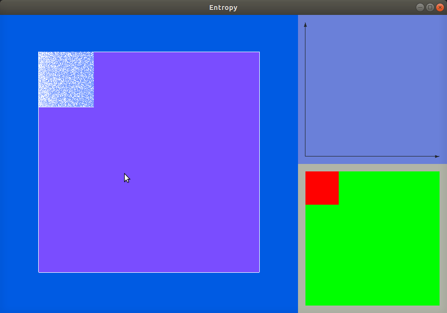

# Projekt symulujący entropię gazu w przestrzeni dwuwymiarowej
Zadanie zrealizowane na zajęcia z fizyki. Celem ćwiczenia była implementacja animacji oraz zaobserwowanie kształtu krzywej entropii.




# Budowa i uruchomienie
Projekt testowany na Ubuntu. Do uruchomienia potrzebna jest biblioteka [SFML](https://www.sfml-dev.org/download/sfml/2.5.1/).

```
$ cd entropia
$ mdkir build
$ cd build
$ cmake ..
$ make
$ ./Entropy
```
